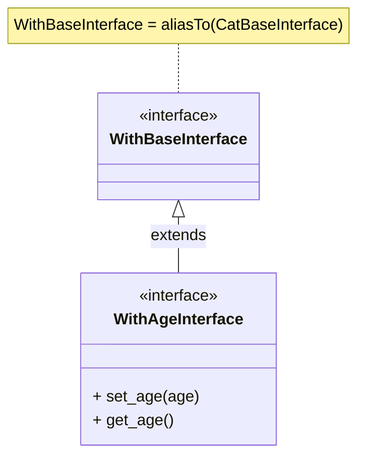

# \[spec-001\] A Convention for Structuring Classes Using Partial Classes

This language-agnostic document introduces a convention for structuring individual classes using partial classes. It focuses on simplifying class definitions by splitting them into manageable parts, enhancing modularity and maintainability.

In a separate specification, we'll explore how to extend this approach horizontally across groups of classes, which is particularly useful when partials represent features in a project or package.

## Background

Partial classes enable you to split a single class definition across multiple source files. Each partial class contains a portion of the overall class, and all parts are combined to form the complete class. This approach helps manage complex classes by dividing them into smaller, more manageable pieces.

Example:

```pseudo
class Partial1
├── +method1()
└── +method2()

class Partial2
├── +method3()
└── +method4()

...

class ClassA
├── extends Partial1
├── ...
└── extends PartialN
```

Using partial classes is beneficial in several scenarios:

- **Modularity**: Large classes can be broken down into smaller sections for easier understanding and maintenance.
- **Organization**: Related methods can be grouped together, improving code structure.
- **Collaboration**: Multiple developers can work on different parts simultaneously, reducing merge conflicts.

## Partial Classes vs. Traits

While both partial classes and traits allow you to split a class's functionality, they serve different purposes.

**Partial classes** are used to split a single class into multiple parts.

**Traits**, on the other hand, provide reusable methods that can be incorporated into multiple classes.

## Support in Programming Languages

Some programming languages, like C#, provide built-in support for partial classes using the `partial` keyword. This feature allows you to split a class definition across multiple files, which are then combined at compile time.

In languages without native support for partial classes, such as Python, you can achieve similar modularity through traits, mixins, multiple inheritance, or single inheritance composition.

It's important to note that while traditional partial classes are combined during compilation, in this specification, we use the term "partial classes" differently. Here, it refers to splitting a class into multiple parts for better organization and modularity, with the parts combined at the source code level rather than at compile time.

## Specification

This specification introduces a convention for structuring classes using partial classes. It involves three main components:

1. **Base Class**: Contains the core functionality of the class.
2. **Partials**: Partial classes that add additional functionality.
3. **Composed Class**: Combines the base class and partials into a single class.

An example of a composed class is:

```pseudo
# Base class
class CatBase
├── +set_name(name)
└── +get_name()

# Partial class: WithAge
class WithAge
├── +set_age(age)
└── +get_age()

# Partial class: WithAgility
class WithAgility
├── +set_agility(agility)
└── +get_agility()

# Composed class: Cat
class Cat
├── extends WithAgility
├── extends WithAge
└── extends CatBase
```

In this convention:

- The base class (`CatBase`) includes the essential methods.
- Partial classes are named using the pattern `With<PartialName>` (e.g., `WithAge`, `WithAgility`).
- The composed class (`Cat`) extends the base class and incorporates all partials.

### File Structure

The recommended file structure is:

```pseudo
<class_name>/
├── <class_name>_base.lang       # Base class with core functionality
│
├── partials/                    # Folder containing all partial implementations
│   ├── with_<partial1>.lang     # Partial 1
│   ├── ...                      # Additional partial classes
│   └── with_<partialN>.lang     # Partial N
│
└── <class_name>.lang            # Composed class: base + partials
```

Notes:

- `<class_name>` is the name of your class (e.g., `Cat`).
- The `.lang` extension represents the language-specific file extension (e.g., `.py`, `.cs`).
- Adjust the naming conventions (PascalCase, snake_case, etc.) to match your programming language's standards.

### One-to-One Interface Mapping

To enhance type safety and ensure consistent implementation of methods, each class in this convention must have a corresponding interface. This one-to-one mapping applies to:

- **Base Class**
- **Each Partial Class**
- **Composed Class**

```pseudo
<class_name>/
├── ...                                  # Previous structure
├── <class_name>_base_interface.lang     # Interface for the base class
│
├── partials/                            # Folder containing all partial interfaces
│   ├── with_<partial1>_interface.lang
│   ├── ...
│   └── with_<partialN>_interface.lang
│
└── <class_name>_interface.lang          # Composed interface: base +partial interfaces
```

Interfaces are named by appending `Interface` to its corresponding class name. For example:

- `CatBase` -> `CatBaseInterface`
- `WithAge` -> `WithAgeInterface`
- `Cat` -> `CatInterface`

### Implementation Details

#### Base Class

The **base class** serves as a special partial containing the core functionality of the composed class.

**Interfaces** should not contain any concrete implementations; they should only list method signatures that the concrete classes will implement. This rule applies to all interfaces, including base class interfaces.

Name base interfaces using the pattern `<ClassName>BaseInterface`. For example:

```pseudo
class CatBaseInterface
├── +set_name(name)  # method signature
└── +get_name()      # method signature
```

When writing a concrete class:

- Import its interface and rename it to `ImplementsInterface`.
- The concrete class must inherit from `ImplementsInterface`.

Example:

```pseudo
ImplementsInterface = aliasTo(CatBaseInterface)

class CatBase
├── extends ImplementsInterface
│
├── +set_name(name)  # implementation
└── +get_name()      # implementation
```

Alternatively, you can keep the base class empty and move core functionalities to a partial class, using the empty base class as a marker:

```pseudo
class CatBaseInterface
└──  # empty interface

ImplementsInterface = aliasTo(CatBaseInterface)

class CatBase
└── extends ImplementsInterface
```

#### Partials

**Partials** add additional functionalities to the composed class.

Partial interfaces must always import the base interface, renaming it to `WithBaseInterface` to maintain consistency and distinction. Partial interfaces are named `With<PartialName>Interface`. For example:



For the concrete partial class:

- Import its own interface as `ImplementsInterface`.
- Inherit from `ImplementsInterface`.
- Do not import the base class or other partial classes, even if their methods are used.

Example:

```pseudo
ImplementsInterface = aliasTo(WithAgeInterface)

class WithAge
├── extends ImplementsInterface
│
├── +set_age(age)  # implementation
└── +get_age()     # implementation
```

If a partial depends on other partials, its interface must import those partials' interfaces. For example, `WithAgilityInterface` depends on `WithAgeInterface`:

```pseudo
WithBaseInterface = aliasTo(CatBaseInterface)

class WithAgilityInterface
├── extends WithAgeInterface
├── extends WithBaseInterface
│
├── +set_agility(agility)
└── +get_agility()
```

The concrete class:

```pseudo
ImplementsInterface = aliasTo(WithAgilityInterface)

class WithAgility
├── extends ImplementsInterface
│
├── +set_agility(agility)  # implementation
└── +get_agility()         # implementation
```

Concrete partial classes typically inherit only from `ImplementsInterface`, but they can also inherit from external concrete classes like traits:

```pseudo
class WithPartial3
├── extends SomeTrait
├── extends ImplementsInterface
│
└── ...  # methods
```

#### Composed Class

The **composed class** combines the base class and all partials into one.

Its interface must import all partial interfaces and the base interface and is named `<ClassName>Interface`:

```pseudo
WithBaseInterface = aliasTo(CatBaseInterface)

class CatInterface
├── extends WithAgilityInterface
├── extends WithAgeInterface
└── extends WithBaseInterface
```

The concrete composed class must:

- Import and inherit from the concrete classes of all partials.
- Import the concrete base class (`WithBase`).
- Import its own interface as `ImplementsInterface`.
- Inherit from `ImplementsInterface`.

Example:

```pseudo
WithBase = aliasTo(CatBase)
ImplementsInterface = aliasTo(CatInterface)

class Cat
├── extends WithAgility
├── extends WithAge
├── extends WithBase
└── extends ImplementsInterface
```

The composed class and its interface should remain empty, serving only to combine components. For additional methods or attributes, create a new partial.

### Additional Considerations

1. **Inheritance Order**

    When importing `ImplementsInterface`, place it at the bottom of the inheritance chain to allow overriding by other classes:

    ```pseudo
    class MyClass
    └── extends ThirdClass
         └── extends SecondClass
              └── extends ImplementsInterface
    ```

2. **Dependency Ordering**

    When importing partials and their interfaces, order them from highest-level dependencies to the base. The base class (`WithBase` or `WithBaseInterface`) is the most fundamental dependency:

    ```pseudo
    class Cat
    ├── extends WithAgility
    ├── extends WithAge
    ├── extends WithBase
    └── extends ImplementsInterface
    ```
